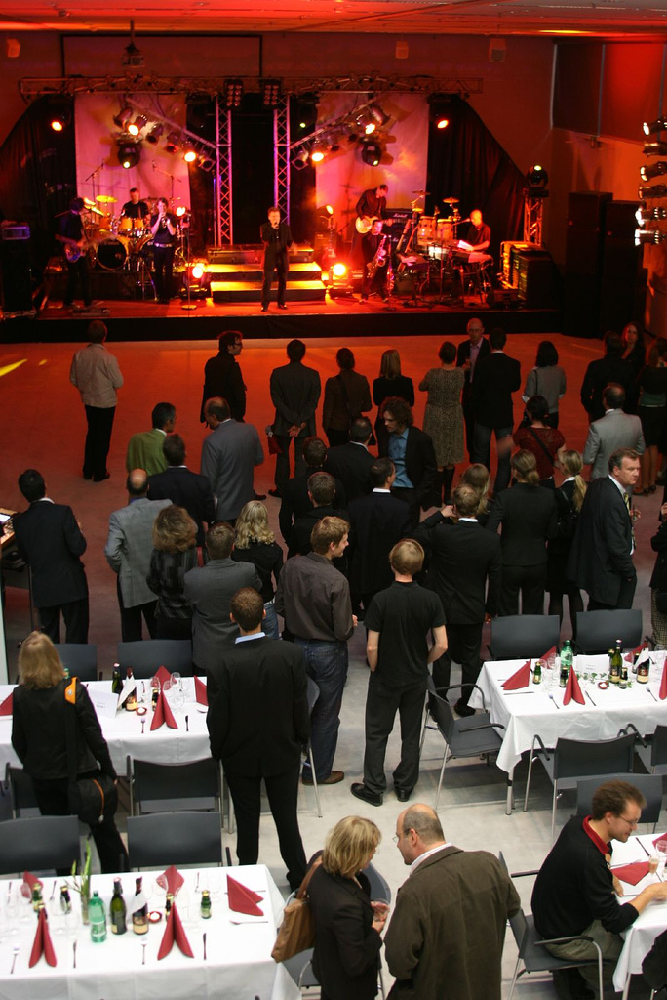
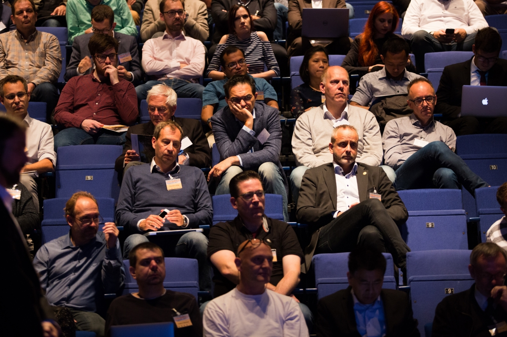
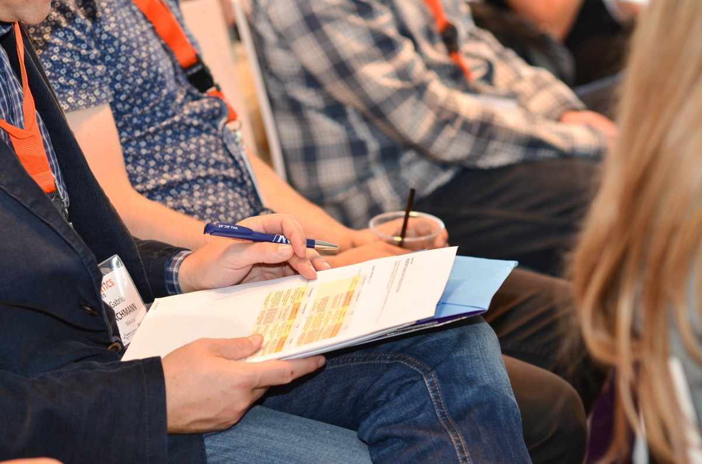
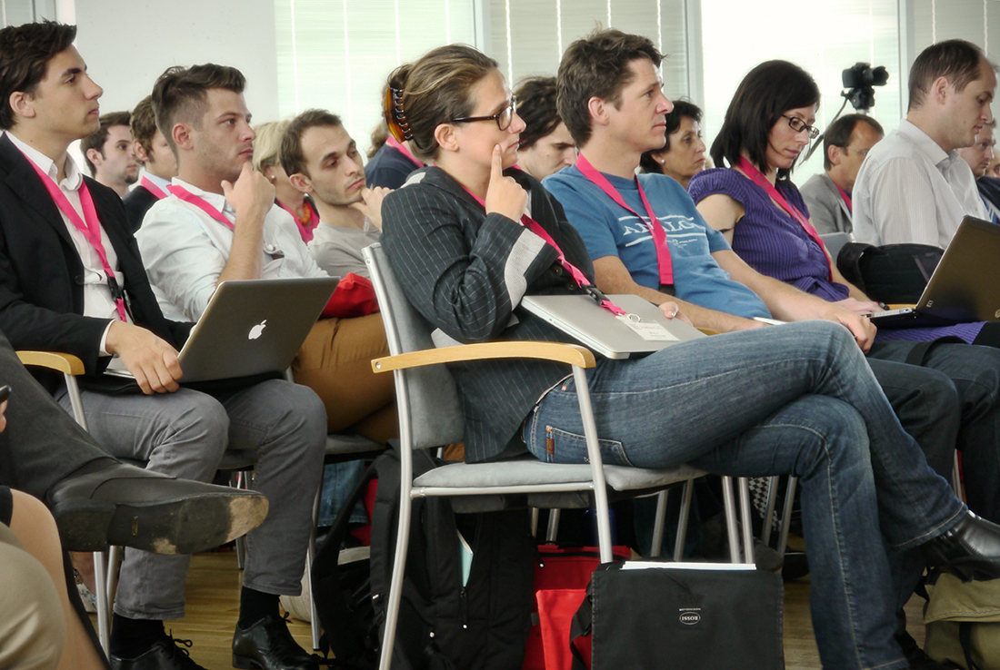

# Press Corner

 SEMANTiCS stands as the main European event dedicated to exploring the significance of semantic technologies, which serve as critical components driving the development and deployment of data-driven applications. As the 20th edition approaches, SEMANTiCS continues its tradition of bringing together leaders from diverse industries, distinguished researchers, data scientists, information management professionals, and experts in digital transformation. This convergence of expertise creates the ideal environment to foster collaboration and facilitate the exchange of knowledge. 

 
If you wish to cover the conference or conduct interviews with the speakers, please don't hesitate to contact our PR team. Reach out to us for media accreditation!

### Press pictures

<table>
<col class="col0">
<col class="col1">
<col class="col2">
<col class="col3">
<tbody>
    <tr>
      <td rowspan="2"></td>
      <td></td>
      <td></td>
      <td></td>
    </tr>
    <tr>
      <td></td>
      <td></td>
      <td></td>
    </tr>
    <tr>
      <td colspan="4" style="padding-top: 0px; text-align: left">Pictures free for reuse: CC by SEMANTICS</td>
    </tr>
</tbody>
</table>
 
