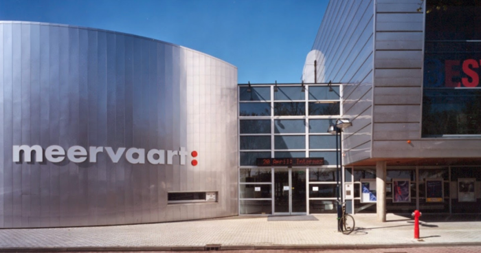
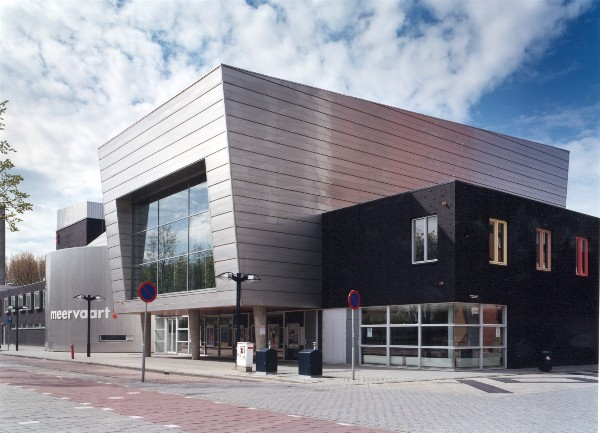
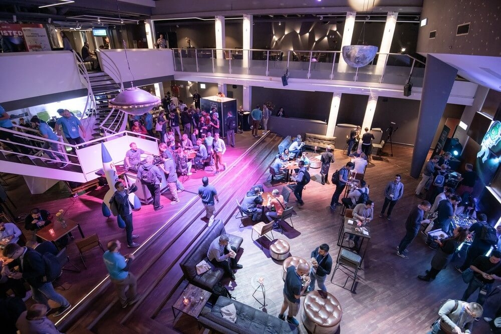

# Venue

 
   
   

 

***SEMANTiCS 2024 is hosted by the Vrije Universiteit Amsterdam. The SEMANTiCS conference will take place at the Meervaart Theatre in Amsterdam.***

Meervaart, Meer en Vaart 300, 1068 LE Amsterdam, Netherlands

The Meervaart is one of the best known venues in the Netherlands and offers facilities for groups from 12 to 800 people. The Meervaart is a conference centre and theatre that hosts over 100 conferences per year. It is uniquely located on the banks of a city lake, the Sloterplas. Almost exactly in the middle between Schiphol airport and the Amsterdam city centre, the venue is easily accessible to visitors from near and far. Multiple public transport options are available on the doorstep, as well as ample, low-cost parking. The National Congress and Meeting Classification classifies the Meervaart as a venue with a luxury business atmosphere, that measures up to the strictest technical requirements for meetings and conferences.  

 Recommended Hotels

<table>
  <tr>
    <th>Hotel</th>
    <th>Address</th>
    <!--<th>Get a reduced rate until</th>-->
  </tr>

  <tr>
    <td><a href="https://westcordhotels.de/hotel/fashion-hotel-amsterdam/">WestCord Fashion Hotel</a></td>
    <td>Hendrikje Stoffelssstraat 1 1058 GC Amsterdam  phone: +31 (0) 208100800 <a href="mailto:fashion@westcordhotels.nl">fashion@westcordhotels.nl</a></td>
    <!--<td>10.09.2023 Please write an email to <a href="mailto:semantics@infai.org">semantics@infai.org</a></td>-->
  </tr>
</table>
 

We have secured contingents in a few hotels in Amsterdam. After you have purchased your Semantics ticket, you will automatically receive an email from the registration system ConfTool containing this list.

### Low-price accommodation

<table>
  <tr>
    <th>Hotel</th>
    <th>Address</th>
  </tr>
</table>  

## Parking spaces in Amsterdam
Check all [car parks](https://www.meervaart.nl/theater/english/uw-bezoek/bereikbaarheid-en-parkeren) in Amsterdam.